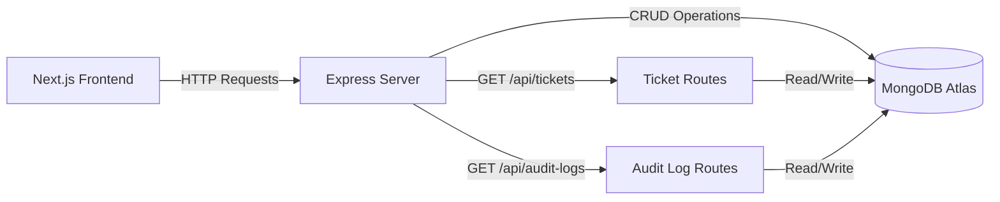

<div align="center">


<br/>

[](https://git.io/typing-svg)

<br/>

<p align="center">
  
  
  
  
  
</p>

<p align="center">
  
  
  
</p>

</div>

---

<div align="center">

## 🦁 About LionXcode

</div>

> **LionXcode** is a freelance development brand delivering high-quality, production-ready web applications. This project was built as **paid work** for a final year college student — crafted with full attention to detail, clean architecture, and real-world deployment.

<div align="center">

```
╔══════════════════════════════════════════════════════════╗
║                                                          ║
║   🦁  LionXcode  —  Code That Roars                     ║
║                                                          ║
║   Freelance · Full Stack · Production Ready              ║
║                                                          ║
╚══════════════════════════════════════════════════════════╝
```

</div>

---

<div align="center">

## 🎯 Project Overview

</div>

**TicketSolved Backend** is the REST API server powering the HR Ticket Management System. Built with **Express.js** and **MongoDB**, it handles all ticket and audit log operations with full CORS support for the Next.js frontend.

<div align="center">



</div>

---

<div align="center">

## 🛠️ Tech Stack — Backend

</div>

```yaml
Runtime:      Node.js (ES Modules)
Framework:    Express.js 4.18
Database:     MongoDB 5 (Atlas)
ODM:          Native MongoDB Driver
CORS:         cors 2.8
Config:       dotenv 16
Dev Tool:     nodemon 3
Deployment:   Vercel Serverless
```

---

<div align="center">

## 📡 API Endpoints

</div>

### 🎫 Tickets — `/api/tickets`

| Method | Endpoint | Description |
|--------|----------|-------------|
| `GET` | `/api/tickets` | Fetch all tickets |
| `POST` | `/api/tickets` | Create a new ticket |
| `PATCH` | `/api/tickets/:id` | Update ticket (status, assignee, comment) |

### 📋 Audit Logs — `/api/audit-logs`

| Method | Endpoint | Description |
|--------|----------|-------------|
| `GET` | `/api/audit-logs` | Fetch all audit logs (sorted by timestamp) |
| `POST` | `/api/audit-logs` | Create a new audit log entry |

---

<div align="center">

## 🚀 Getting Started

</div>

```bash
# Clone the repository
git clone https://github.com/acelion55/HRMS_FRONTEND.git
cd HRMS_FRONTEND

# Install dependencies
npm install

# Set up environment variables
# Create a .env file with:
MONGODB_URI=your_mongodb_connection_string
MONGODB_DB_NAME=hrms
PORT=5000

# Run development server
npm run dev

# Run production server
npm start
```

---

<div align="center">

## 📁 Project Structure

</div>

```
back/
├── index.js              # Express app entry point
├── lib/
│   └── mongodb.js        # MongoDB connection helper
├── routes/
│   ├── tickets.js        # Ticket CRUD routes
│   └── audit-logs.js     # Audit log routes
├── .env                  # Environment variables (not committed)
├── .gitignore
└── package.json
```

---

<div align="center">

## ⚙️ Environment Variables

</div>

```env
MONGODB_URI=mongodb+srv://<user>:<password>@cluster.mongodb.net/
MONGODB_DB_NAME=hrms
PORT=5000
```

---

<div align="center">

## 🌐 Live API

<a href="https://hrbackend-taupe.vercel.app">
  
</a>

<br/><br/>

| Endpoint | URL |
|----------|-----|
| Tickets | `https://hrbackend-taupe.vercel.app/api/tickets` |
| Audit Logs | `https://hrbackend-taupe.vercel.app/api/audit-logs` |

<br/>

---

## 🦁 Built by LionXcode


*This project was delivered as paid freelance work for a final year college student.*
*Clean code. Real deployment. Production quality.*

**LionXcode — Code That Roars 🦁**

</div>
